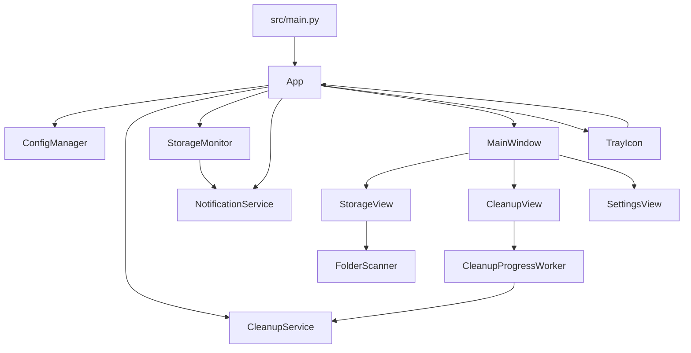

# Architecture

## Overview

CleanBox is a single-process Windows desktop application built on PyQt6. `src/main.py` bootstraps logging, then creates `App`, which owns configuration, background services, the main window, and the tray icon.

## Runtime Model

- `App.start()` creates the Qt application, acquires a single-instance lock with `QLocalServer`, and forwards `show` requests from later launches through `QLocalSocket`.
- On first run, `get_default_directories()` seeds the cleanup list with the current user's `Downloads` folder plus the Recycle Bin marker.
- The app enables auto-start when `ConfigManager.auto_start_enabled` is true.
- `StorageMonitor` starts immediately and emits low-space signals to `NotificationService`.
- `MainWindow` is shown on startup and remains available after close because `closeEvent()` hides the window instead of quitting the process.
- `TrayIcon` runs on a separate thread and routes user actions back into Qt through thread-safe signals owned by `App`.

## Module Map

- `src/main.py`
  Bootstraps logging to `%USERPROFILE%\.cleanbox\cleanbox.log`, adds `src` to `sys.path`, and starts the application.

- `src/app.py`
  Central coordinator for application startup, service construction, signal wiring, first-run behavior, cleanup execution, tray actions, and shutdown.

- `src/shared/constants.py`
  Defines app constants, asset paths, config paths, default thresholds, registry key, and the protected-path allowlist/blocklist inputs.

- `src/shared/config/manager.py`
  Loads and saves JSON config, filters protected paths, performs atomic writes with backup recovery, and exposes typed accessors for persisted settings.

- `src/shared/registry.py`
  Implements Windows auto-start enable/disable checks using `winreg`, with `schtasks` fallback behavior when registry writes are unavailable.

- `src/shared/elevation.py`
  Handles elevation checks and restart-with-admin requests used by the Settings view.

- `src/features/cleanup/`
  `service.py` empties configured directories and the Recycle Bin.
  `worker.py` runs cleanup in the background and emits progress.
  `directory_detector.py` resolves default cleanup targets.

- `src/features/folder_scanner/`
  Implements recursive and real-time directory scanning with `os.scandir()`, adaptive worker counts, cached metadata, skip accounting, and lazy expansion support.

- `src/features/storage_monitor/`
  Polls local drives on a timer, emits low-space signals, tracks per-drive notification cooldowns, and periodically triggers GC plus RSS logging.

- `src/features/notifications/service.py`
  Sends Windows toasts through `win11toast` and falls back to tray balloon notifications or logs.

- `src/ui/main_window.py`
  Hosts the split-view shell, sidebar navigation, and the `Storage`, `Cleanup`, and `Settings` views.

- `src/ui/views/storage_view*.py`
  Provide the Storage Analyzer tree, real-time scan workers, navigation history, context menu actions, and tree-item helpers.

- `src/ui/views/cleanup_view.py`
  Lets users manage cleanup directories and launch the cleanup workflow with progress feedback.

- `src/ui/views/settings_view.py`
  Exposes auto-start and elevation controls, and displays threshold/interval controls.

## Main Flows

### Startup

1. `main()` configures logging and instantiates `App`.
2. `App.start()` builds `QApplication`, enforces single-instance behavior, and loads config.
3. First-run setup adds default cleanup targets.
4. `StorageMonitor` starts polling drives.
5. `MainWindow` and `TrayIcon` are initialized and shown/started.

### Cleanup

1. A cleanup request comes from the tray or `CleanupView`.
2. `App._do_cleanup()` checks for an active worker and shows a confirmation dialog.
3. `CleanupProgressWorker` runs the cleanup in the background.
4. `CleanupService` empties configured directories or the Recycle Bin marker target.
5. Progress is reflected in the main window and tray tooltip.
6. Completion triggers a notification and clears worker state.

### Storage Analysis

1. `StorageView` requests a scan for the selected path.
2. `FolderScanner` walks the filesystem with `os.scandir()` and adaptive parallelism for child directories.
3. Real-time child results are buffered into the UI while scan-completeness stats are accumulated.
4. The tree view caches scanned nodes for back/forward navigation and lazy expansion.
5. Context-menu actions can add a directory to cleanup, move a target to the Recycle Bin, or open its location in Explorer.

### Low-Space Notification

1. `StorageMonitor` polls `get_all_drives()`.
2. Drives below the configured threshold emit `low_space_detected`.
3. `NotificationService` sends a toast or tray fallback notification.
4. The monitor suppresses duplicate notifications for the same drive until the cooldown expires or space recovers.

## Key Decisions

- Single-instance behavior is enforced at runtime instead of relying on the installer.
- Cleanup and scan work run off the main UI thread to keep the window responsive.
- Protected-path checks exist in config management, cleanup operations, and storage-view actions to reduce destructive-user-error paths.
- Auto-start prefers the current-user registry key and falls back to Task Scheduler when registry writes fail.
- The storage analyzer favors streamed `os.scandir()` traversal and bounded parallelism over full directory materialization.

## Observed Implementation Notes

- `SettingsView` emits `threshold_changed` and `interval_changed`, but `App` currently wires only `autostart_changed` and `restart_as_admin_requested`. The docs therefore describe auto-start and elevation as the supported settings flow.
- The Settings footer currently hardcodes `CleanBox v1.0.0`, while `pyproject.toml` and `VERSION` report `1.0.18`.
