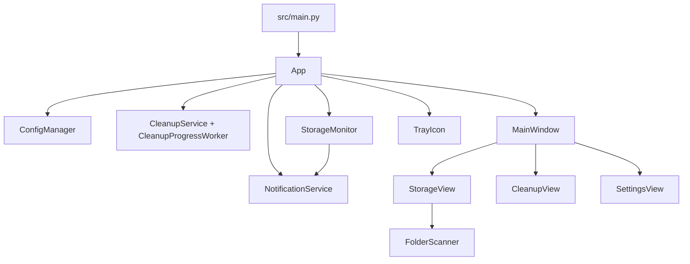

# Kiến trúc CleanBox

## Tổng quan

CleanBox là ứng dụng desktop Windows chạy một tiến trình, dùng PyQt6 làm event loop/UI. `src/main.py` khởi tạo logging rồi chuyển quyền điều phối cho `App` trong `src/app.py`.

## Runtime model

- `App.start()`:
  - Tạo `QApplication` và đặt `setQuitOnLastWindowClosed(False)` để tiếp tục chạy nền.
  - Bảo đảm chạy một instance bằng `QLocalServer` (`SINGLE_INSTANCE_KEY`).
  - Nếu mở app lần đầu: tự thêm thư mục mặc định qua `get_default_directories()`.
  - Khởi tạo `StorageMonitor` theo giá trị threshold/interval từ config.
  - Khởi tạo `MainWindow`, kết nối signal giữa UI và service.
  - Khởi tạo `TrayIcon` và gắn fallback notification.

- Vòng đời cửa sổ:
  - Đóng cửa sổ chính chỉ `hide()`, không thoát process.
  - Lệnh `Exit` từ tray gọi `_do_exit()` để dừng monitor/tray và thoát Qt app.

## Bản đồ module

- `src/main.py`: bootstrap logging (`%USERPROFILE%/.cleanbox/cleanbox.log`) và khởi động app.
- `src/app.py`: orchestration tổng, xử lý signal, điều phối cleanup/storage monitor/notification/tray.
- `src/shared/constants.py`: hằng số runtime, đường dẫn config, protected paths, marker Recycle Bin.
- `src/shared/config/manager.py`: đọc/ghi config JSON, backup, atomic write, normalize dữ liệu notified drives.
- `src/shared/registry.py`: bật/tắt auto-start qua Registry (fallback Task Scheduler).
- `src/shared/elevation.py`: kiểm tra quyền admin và restart với quyền admin.
- `src/features/cleanup/service.py`: dọn dẹp thư mục + Recycle Bin.
- `src/features/cleanup/worker.py`: chạy cleanup nền, phát tiến độ.
- `src/features/storage_monitor/service.py`: polling ổ đĩa, phát hiện low-space, cooldown thông báo.
- `src/features/folder_scanner/service.py`: scan thư mục (single level/realtime/full), tối ưu hiệu năng scan.
- `src/features/notifications/service.py`: toast Windows + fallback tray.
- `src/ui/main_window.py`: shell UI, sidebar, view switching, signal forwarding.
- `src/ui/views/storage_view.py`: Storage Analyzer (tree, realtime scan, lazy expand, context actions).
- `src/ui/views/cleanup_view.py`: quản lý danh sách cleanup, nút Clean Now, progress bar.
- `src/ui/views/settings_view.py`: auto-start, threshold, interval, restart as admin.

## Luồng chính

### 1) Khởi động
1. `main()` gọi `setup_logging()`.
2. `App.start()` tạo Qt app và kiểm tra single-instance.
3. Load config, xử lý first-run.
4. Start `StorageMonitor`.
5. Render `MainWindow` và start `TrayIcon`.

### 2) Dọn dẹp
1. Người dùng bấm `Clean Now` từ tray hoặc Cleanup View.
2. `App._do_cleanup()` kiểm tra đang có worker chạy hay chưa.
3. Hiện hộp thoại xác nhận liệt kê thư mục sẽ dọn.
4. Tạo `CleanupProgressWorker` chạy nền.
5. UI/tray cập nhật tiến độ qua signal `progress_updated`.
6. Khi xong, gửi notification tổng kết và reset trạng thái worker.

### 3) Phân tích lưu trữ
1. Storage View nhận ổ đĩa từ `StorageMonitor.get_all_drives()`.
2. Khi scan, worker realtime phát dữ liệu từng child để hiển thị dần.
3. Tree sử dụng cache/path index để điều hướng nhanh và lazy expand.
4. Context menu hỗ trợ Add to Cleanup, Delete to Recycle Bin, Open location.

### 4) Cảnh báo low-space
1. `StorageMonitor` poll ổ đĩa theo chu kỳ.
2. Nếu `free_gb < threshold_gb`: emit `low_space_detected`.
3. `App` gọi `NotificationService.notify_low_space()` và lưu timestamp vào config.
4. Khi ổ hồi phục: emit `low_space_cleared` để xóa trạng thái notified.

## Quyết định kiến trúc quan trọng

- Dùng single-instance lock ở runtime, không phụ thuộc installer.
- Tách UI và tác vụ nặng bằng QThread để giữ giao diện phản hồi.
- Áp dụng bảo vệ đường dẫn hệ thống ở nhiều tầng để giảm rủi ro thao tác phá hủy.
- Trạng thái cooldown cảnh báo ổ đĩa được persist để tránh spam sau khi restart app.
- Hướng tối ưu scanner: stream + batching + cache điều hướng thay vì dựng full tree ngay lập tức.

## Vấn đề kỹ thuật còn mở

- Footer trong Settings đang hardcode `CleanBox v1.0.0`, chưa lấy từ `VERSION`/metadata hiện hành (`1.0.18`).
